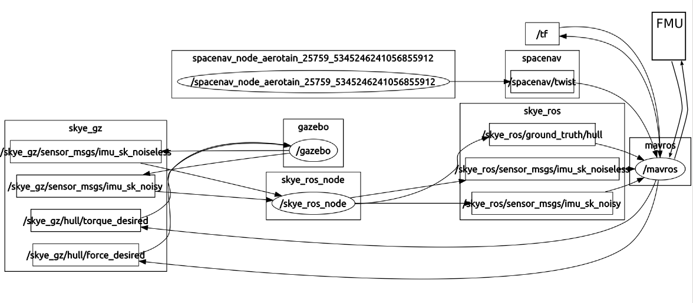

MAVROS
======

[](https://gitter.im/mavlink/mavros?utm_source=badge&utm_medium=badge&utm_campaign=pr-badge&utm_content=badge)

MAVLink extendable communication node for ROS.


mavros package
--------------

It is the main package, please see it's README.


mavros\_extras package
----------------------

This package contain some extra nodes and plugins for mavros, please see it's README.


libmavconn package
------------------

This package contain mavconn library, see it's README.
LibMAVConn may be used outside of ROS environment.


test\_mavros package
--------------------

This package contain hand-tests and [manual page][test] for APM and PX4 SITL.
Please see [README][test] first!


mavros\_msgs package
--------------------

This package contain messages and services used in mavros.


Support forums and chats
------------------------

Please ask your questions not related to bugs/feauture requests on:

- [px4users Google Group (Mailing List) ](https://groups.google.com/forum/#!forum/px4users)
- [Mavros on Gitter IM](https://gitter.im/mavlink/mavros)
- [PX4/Firmware on Gitter IM](https://gitter.im/PX4/Firmware)

We'd like to keep the project bugtracker as free as possible, so please contact via the above methods. You can also PM us via Gitter.


## Skye Hardware In The Loop
It is possible to test Skye's firmware with a hardware in the loop (HIL) simulation using mavros as a link between mavlink and ros-gazebo. The current tutorial has been tested with ROS Indigo.

### Requirements
The following repositories are required in the catkin space where mavros is going to be installed: skye_gazebo_simulation and mavlink. You are going to install mavlink with the following instructions, and it is assumed that you have already installed [Skye Gazebo Simulation](https://github.com/skye-git/skye_gazebo_simulation/tree/px4fmu/hil).

### Mavlink-ROS Package And Skye Dialect
You will be using the ROS python tools wstool, rosinstall, and catkin_tools for this installation. While they may have been installed during your installation of ROS you can also install them with:
```bash 
sudo apt-get install python-wstool python-rosinstall-generator python-catkin-tools
```
Now you're ready to get a copy of the source file of mavlink package.

**Warning**: you should have already created a catkin workspace named "catkin\_ws" when you followed [Skye Gazebo Simulation](https://github.com/skye-git/skye_gazebo_simulation/tree/px4fmu/hil)
```bash
cd ~/catkin_ws
git clone git@github.com:skye-git/mavlink.git -b px4fmu/hil
```
Now you can download the mavros package and sapcenav drivers and compile them. 
**Warning:** you must perfom the following actions in the same workspace used for the installation of "skye_gazebo_simulations", that is assumed to be "~/catkin_ws".
```bash
cd ~/catkin_ws/src/
git clone https://github.com/skye-git/mavros -b px4fmu/hil
git clone https://github.com/skye-git/joystick_drivers
cd ~/catkin_ws
 #compile using skye dialect from mavlink package
catkin build -j8 --cmake-args -DMAVLINK_DIALECT=skye
```

It is conviniente to source the setup.* file
```bash
source ~/catkin_ws/devel/setup.sh
```

**Warning:** since mavros cannot use the [c_library](https://github.com/skye-git/c_library) repo directly, you must pull the latest files into the mavlink folder and then compile the mavlink repo again specifying the desired dialect. You must specify the skye dialect, with the option '--cmake-args -DMAVLINK_DIALECT=skye', everytime you compile mavros.

#### Troubleshooting
In case of `CMake Error: Could not find a package configuration file provided by "control_toolbox"`, please install the following packages:
```bash
sudo apt-get install ros-indigo-ros-control ros-indigo-ros-controllers
```

###Usage
To launch the HIL simulation identify to which USB port Mavlink is communicating and then type in a new terminal
```bash
roslaunch mavros skye_hil.launch fcu_url:=/dev/ttyUSB0:921600
```
In the above example Mavlink is using USB0 and a baud rate of 921600. This launch file starts Gazebo in pause. You can press the "play" button whenever you are ready to start the simulation.
After the play button is pressed, a hil enabling message is sent to the FMU by mavros as soon as a heartbeat message is received from the FMU.

####Changing Firmware Parameter
During HIL simulation it is not possible to change onboard paramters via QGroundControl. The below list of services shows how to change onboard parameters.

  * /mavros/skye/set_att_c_mod sets the attitude control mode. Possible values: 0 (Manual), 1 (5DOF), 2 (6DOF), 3 (6DOFI), 4 (SKYE_ATT_C_MOD_GEOM), 5 (SKYE_ATT_C_MOD_MAX);
  * /mavros/skye/set_pos_c_mod sets the position control mode. Possible values: 0 (Manual), 1 (cascade pid);
  * /mavros/skye/set_param sets a generic parameter in the FMU;
  * /mavros/skye/send_step_setpoint_6dof send a specified step command for the specified duration to the FMU.
  
Examples:

```bash
rosservice call /mavros/skye/set_att_c_mod 0
rosservice call /mavros/skye/set_pos_c_mod 1
rosservice call /mavros/skye/set_param 'INTEGER_PARAM_NAME' '[PARAM_VALUE, 0.0]'
rosservice call /mavros/skye/set_param 'FLOAT_PARAM_NAME' '[0, PARAM_VALUE]'
```
####Testing Allocator Output
By default option the outputs of the attitude and position controllers are directly applied to the center of gravity of the hull. If you want to test the allocator output and apply a 2D force in each AU, then you can type
```bash
roslaunch mavros skye_hil.launch fcu_url:=/dev/ttyUSB0:921600 use_allocator_output:=true
```

####Selecting Skye's Model 
You can use different models, specifying the command line parameter 'model_name', for instance:
```bash
roslaunch mavros skye_hil.launch fcu_url:=/dev/ttyUSB0:921600 model_name:=tetra
```
Note: the firmware of the FMU should be change according to the model you want to use.
####Messages exhange Scheme
<p align="center">
  
</p>
